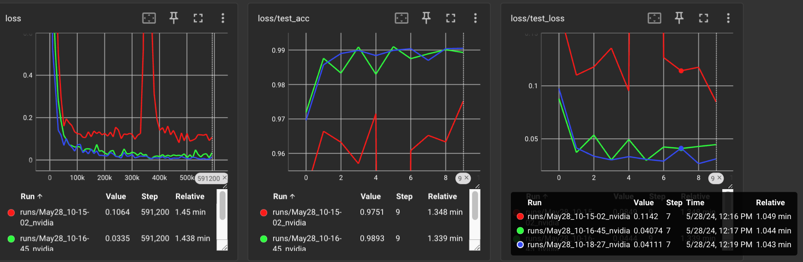
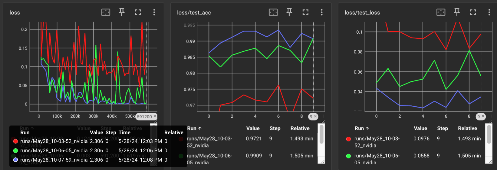

# LAMB16

LAMB16 is an optimizer proposed by Chunqing "Jyn" Shan, based on the LAMB[1] optimizer. It enables training with float8
optimizer state while maintaining float32 precision for weights and backpropagation gradients. This significantly
reduces memory size and bandwidth requirements. Additionally, LAMB16 incorporates adaptive trust based on learning
rate, which helps rescale the trust rate to a reasonable range when the learning rate is not typical (e.g., 0.01).

These modifications make LAMB16 more stable and capable of converging faster than both Adam and LAMB, ultimately
reaching the smallest final loss. By requiring only 16 bits for each parameter (hence the name LAMB16), it uses
1/4 the memory size and bandwidth of Adam or LAMB. With optimized kernels (e.g., performing float decompression
in the kernel and keeping FP32 in L1/shared memory), it can be even faster.

LAMB16 works transparently like an FP32 optimizer with a 1/4 memory footprint, without the need for AMP or changes
to the ML workflow. It stores per-element adaptive learning rates, avoiding the side effects of other memory-aware
optimizers (e.g., Adafactor). It also enables much larger batch size training, similar to the LAMB optimizer.

## Algorithm

LAMB16 calculates the per-layer norm of the first moment estimate (m) and the second moment estimate (v) in addition
to the norm of the weights and adam_delta. The m_norm and v_norm are stored as float32 scalar values in the optimizer's
state. The normalized m and v are then calculated by dividing m and v by their respective norms and stored in
float8_e4m3fn and float8_e5m2 formats in the optimizer's state. This results in a total state size of 50% of the
weight size, with 16 bits for each parameter (compared to 64 bits per parameter or 200% of the weight size for Adam or LAMB).

LAMB16 enables training with 1/4 the memory requirement(and 1/4 bandwidth overhead) for optimizer state
compared to Adam or LAMB. It also allows for training with much larger batch sizes, a benefit inherited from the
LAMB optimizer. With the same hyperparameters, LAMB16 converges faster than Adam and the original LAMB. Considering
its significantly reduced memory bandwidth requirement, it should be much faster than both in practice.

## Implementation

This is a proof-of-concept implementation based on cybertronai's pytorch-lamb. I wrote a new Optimizer for LAMB16
and reused the test_lamb.py(mian/CLI) and their implementation of original LAMB, so we can compare the
performance of Adam, LAMB, and LAMB16.

## Results

The following results demonstrate the performance of Adam, LAMB, and LAMB16 optimizers when training the MNIST
dataset with a batch size of 1024, a learning rate of 0.02, and a weight decay of 0.01.

The red line represents Adam, the green line represents LAMB, and the blue line represents LAMB16.

The following results demonstrate the performance of Adam, LAMB, and LAMB16 optimizers when training the MNIST
dataset with a batch size of 128, a learning rate of 0.01, and a weight decay of 0.01.

The red line represents Adam, the green line represents LAMB, and the blue line represents LAMB16.

## Reference

1. LAMB: [Large Batch Optimization for Deep Learning: Training BERT in 76 minutes](https://arxiv.org/abs/1904.00962).
2. https://github.com/cybertronai/pytorch-lamb, the original LAMB optimizer implementation.
