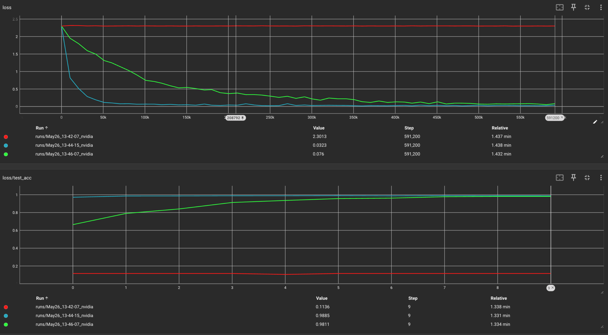

# LAMB16

`LAMB16` is an optimizer proposed by Chunqing "Jyn" Shan, based on `LAMB`[1] optimizer.
It is designed to enable training with `float8` optimizer state, while still keeping `float32` precision for
weight(and overall backpropagation precision is stll `float32`), which means much less memory size
and bandwidth requirement. It converges faster than `Adam` but slower than `LAMB`, at the same hyperparameters.

Because it only requires 16bit for each parameter(hence the name `LAMB16`), which
means it requires `1/4` the memory size and bandwidth of `Adam` or `LAMB`, it should
be faster when implemented with optimized kernels.

It also enables much larger batch size training, just like `LAMB` optimizer.

## Algorithm

Instead of only calculating the norm of the `weights` and `adam_delta`, `LAMB16` also calculates the norm of the
first moment estimate `m` and the second moment estimate `v`, then store `m_norm` and `v_norm` in the `state` of the
optimizer as float32 scalar value.

After that, `LAMB16` calculates `m`/`m_norm` and `v`/`v_norm` to get the normalized `m` and `v`, it is stored in
`float8_e4m3fn` format in the `state` of the optimizer. Which means, the total `state` of the optimizer is `50%` of
the size of weight, 16 bit for each parameter(`Adam` or `LAMB`'s state is 64 bit for each parameter, or `200%` of the
size of weight).

`LAMB16` can enable training with half the memory(when including weight) requirement and `1/4` the memory bandwidth
overhead compared to `Adam` or `LAMB`.

It also enables training with much larger batch size, a benefit from `LAMB` optimizer. The convergence speed at same
hyperparameters is faster than Adam, but slower than original `LAMB`. Consider it enables training with much less memory
bandwidth requirement, it should overall be faster than `LAMB` in practice.

## Implementation

This is a Proof of Concept implementation based on `cybertronai`'s `pytorch-lamb`, which implemented the original `LAMB`
optimizer.

## Results

The following is the result of training `MNIST` dataset with `Adam`, `LAMB` and `LAMB16` optimizer. The batch size is
1024, the learning rate is 0.02, and the weight decay is 0.01.

The red line is `Adam`, the blue line is `LAMB`, and the green line is `LAMB16`. `Adam` can't converge at this batch
size, while `LAMB` and `LAMB16` can converge. `LAMB16` reaches the same loss as `LAMB` after 10 epochs.

## Reference

1. LAMB: [Large Batch Optimization for Deep Learning: Training BERT in 76 minutes](https://arxiv.org/abs/1904.00962).
2. https://github.com/cybertronai/pytorch-lamb, the original `LAMB` optimizer implementation.
